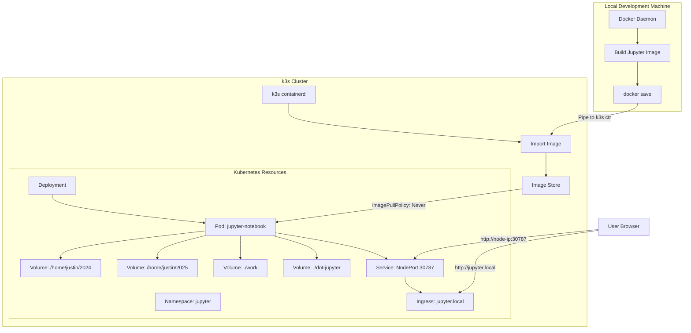
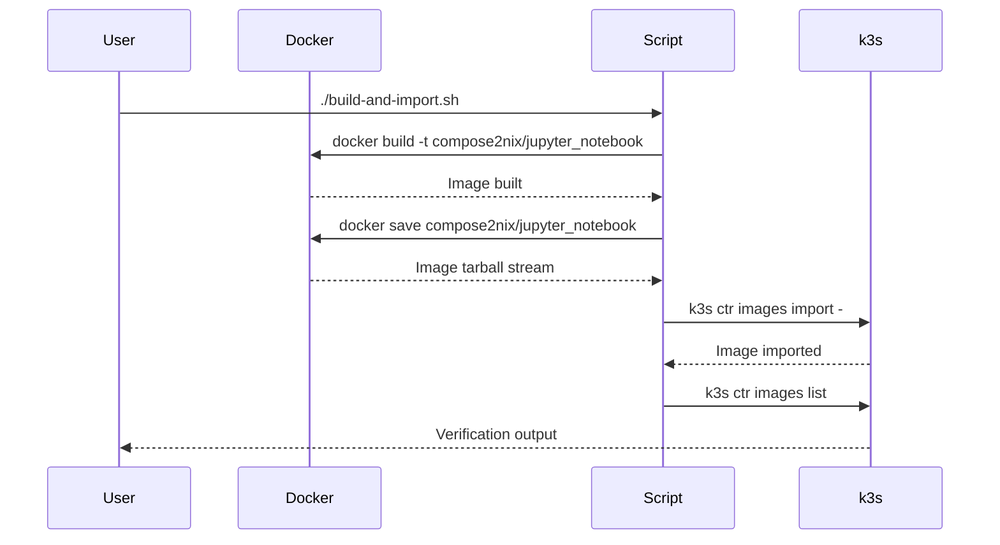
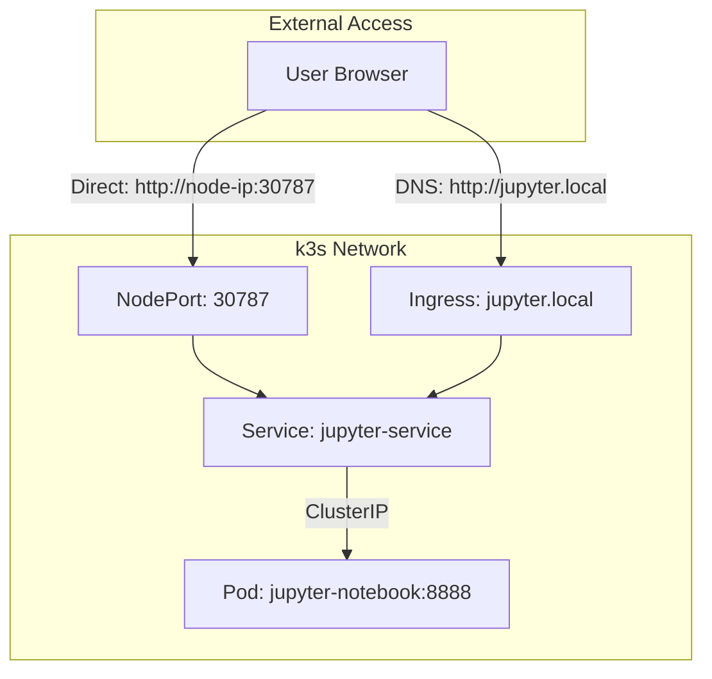

# Jupyter on k3s - Comprehensive Guide

This guide explains how to deploy JupyterLab from your NixOS Docker Compose setup to a k3s Kubernetes cluster without using an external registry.

## Table of Contents
- [Overview](#overview)
- [Architecture](#architecture)
- [Prerequisites](#prerequisites)
- [How It Works](#how-it-works)
- [Deployment Steps](#deployment-steps)
- [Understanding the Components](#understanding-the-components)
- [Troubleshooting](#troubleshooting)
- [Advanced Configuration](#advanced-configuration)

## Overview

This deployment strategy allows you to run your JupyterLab environment on k3s while:
- Building images locally (no external registry needed)
- Preserving all your existing volume mounts
- Maintaining compatibility with your NixOS configuration
- Using the same image configuration as your Docker Compose setup

## Architecture



## Prerequisites

1. **k3s installed and running**
   ```bash
   # Check k3s is running
   sudo k3s kubectl get nodes
   ```

2. **Docker installed** (for building images)
   ```bash
   # Check Docker is available
   docker --version
   ```

3. **Directory structure exists**
   ```bash
   # These directories must exist on the k3s node:
   /home/justin/2024/
   /home/justin/2025/
   /home/justin/2025/jupyter-docker-compose-with-nix/work/
   /home/justin/2025/jupyter-docker-compose-with-nix/dot-jupyter/
   ```

## How It Works

### 1. Image Building and Import Process



**Why this approach?**
- k3s uses containerd, not Docker, as its container runtime
- `docker save` exports images in OCI format
- `k3s ctr images import` imports into k3s's containerd namespace
- No registry push/pull required!

### 2. Volume Mount Strategy

```mermaid
graph LR
    subgraph "Host Filesystem"
        A1[/home/justin/2024/]
        A2[/home/justin/2025/]
        A3[./work/]
        A4[./dot-jupyter/]
    end
    
    subgraph "Pod Container"
        B1[/home/jovyan/work/2024]
        B2[/home/jovyan/work/2025]
        B3[/home/jovyan/work]
        B4[/home/jovyan/.juypter]
    end
    
    A1 --> |"hostPath"| B1
    A2 --> |"hostPath"| B2
    A3 --> |"hostPath"| B3
    A4 --> |"hostPath"| B4
```

**Volume Details:**
- **hostPath volumes** directly mount host directories into pods
- No PersistentVolumeClaims needed - simpler for single-node k3s
- Matches exactly what Docker Compose was doing
- Note the typo `.juypter` is preserved from original config

### 3. Networking Flow



## Understanding the Components

### Namespace (00-namespace.yaml)
```yaml
apiVersion: v1
kind: Namespace
metadata:
  name: jupyter
```
- Creates isolated environment for Jupyter resources
- Prevents naming conflicts with other applications

### Deployment (01-deployment.yaml)
Key configurations:
- **Image**: `compose2nix/jupyter_notebook:latest` (matches NixOS build)
- **imagePullPolicy: Never** - Uses local image, doesn't try to pull
- **Privileged: true** - Required for some Jupyter operations
- **Command**: Matches Docker Compose exactly

### Service (03-service.yaml)
- **Type: NodePort** - Exposes service on all nodes
- **Port 30787** - Accessible from outside cluster
- Maps to container port 8888 internally

### Ingress (04-ingress.yaml)
- Provides hostname-based routing
- Optional but recommended for production
- Requires DNS or /etc/hosts entry

## Deployment Steps

### 1. Build and Import Image
```bash
chmod +x build-and-import.sh
./build-and-import.sh
```

This script:
1. Builds the Docker image using your Dockerfile
2. Exports it as a tarball stream
3. Imports directly into k3s containerd
4. Verifies the import succeeded

### 2. Deploy to k3s
```bash
chmod +x deploy.sh
./deploy.sh
```

This script:
1. Creates the namespace
2. Deploys all Kubernetes resources
3. Waits for pod to be ready
4. Shows access URLs

### 3. Access JupyterLab
Three ways to access:
1. **NodePort**: `http://<your-k3s-node-ip>:30787`
2. **Ingress**: `http://jupyter.local` (requires DNS setup)
3. **Port-forward**: `kubectl -n jupyter port-forward svc/jupyter-service 7887:8888`

## Troubleshooting

### Check Pod Status
```bash
kubectl -n jupyter get pods
kubectl -n jupyter describe pod jupyter-notebook-xxxxx
```

### View Logs
```bash
kubectl -n jupyter logs -l app=jupyter
kubectl -n jupyter logs -l app=jupyter -f  # Follow logs
```

### Verify Image Import
```bash
sudo k3s ctr images list | grep jupyter
```

### Common Issues

1. **Pod CrashLoopBackOff**
   - Check logs for permission errors
   - Verify all host directories exist
   - Check if privileged mode is working

2. **Image Not Found**
   - Ensure image was imported: `sudo k3s ctr images list`
   - Check image name matches exactly
   - Verify `imagePullPolicy: Never` is set

3. **Volume Mount Errors**
   - Verify host paths exist and have correct permissions
   - Check if k3s node has access to paths
   - For multi-node: ensure paths exist on scheduled node

4. **Can't Access Service**
   - Check service is running: `kubectl -n jupyter get svc`
   - Verify firewall allows port 30787
   - Test with port-forward first

### Debugging Commands
```bash
# Check everything in jupyter namespace
kubectl -n jupyter get all

# Describe deployment for events
kubectl -n jupyter describe deployment jupyter-notebook

# Check node details
kubectl get nodes -o wide

# Test service connectivity from inside cluster
kubectl -n jupyter run test --rm -it --image=busybox -- wget -O- http://jupyter-service:8888
```

## Advanced Configuration

### GPU Support
Uncomment the tolerations in deployment.yaml:
```yaml
tolerations:
- key: nvidia.com/gpu
  operator: Exists
  effect: NoSchedule
```

### Multi-Node Deployment
For multi-node clusters:
1. Ensure volumes exist on all nodes, OR
2. Use node selectors to pin to specific node:
```yaml
nodeSelector:
  kubernetes.io/hostname: your-node-name
```

### Using k3s Local Path Provisioner
To use dynamic provisioning instead of hostPath:
```yaml
apiVersion: v1
kind: PersistentVolumeClaim
metadata:
  name: jupyter-work
spec:
  accessModes:
  - ReadWriteOnce
  storageClassName: local-path
  resources:
    requests:
      storage: 10Gi
```

### Security Considerations
1. **Privileged Containers**: Required for current setup but increases security risk
2. **No Token**: Jupyter runs without authentication token
3. **Network Policies**: Consider adding to restrict access
4. **RBAC**: No special permissions needed for basic operation

### Integration with CI/CD
```bash
# Example GitLab CI job
deploy-jupyter:
  script:
    - docker build -t compose2nix/jupyter_notebook:$CI_COMMIT_SHA .
    - docker save compose2nix/jupyter_notebook:$CI_COMMIT_SHA | ssh k3s-node 'sudo k3s ctr images import -'
    - ssh k3s-node 'kubectl -n jupyter set image deployment/jupyter-notebook jupyter=compose2nix/jupyter_notebook:$CI_COMMIT_SHA'
```

## Cleanup

To remove everything:
```bash
chmod +x cleanup.sh
./cleanup.sh
```

This will:
1. Delete all Kubernetes resources
2. Optionally preserve your data volumes
3. Remove the namespace

Note: This does NOT remove the imported image from k3s. To remove:
```bash
sudo k3s ctr images remove compose2nix/jupyter_notebook:latest
```

## Summary

This deployment strategy provides:
- ✅ Local image building (no registry needed)
- ✅ Direct volume access to host directories
- ✅ Same configuration as Docker Compose
- ✅ Easy updates and rollbacks
- ✅ Compatible with existing NixOS setup

The key insight is using `docker save | k3s ctr import` to bridge between Docker and k3s containerd, avoiding the complexity of running a registry while maintaining full control over your images.